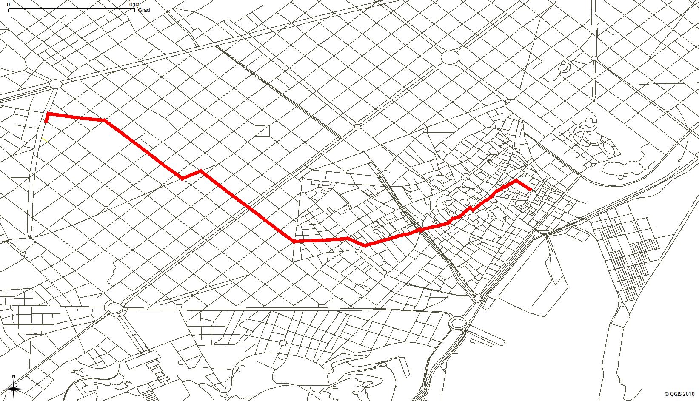

# Dijkstra-using-C_SHARP
#The implementation of Dijkstra using c# 
#i was applied it using also Python 
Dijkstra's algorithm is a popular algorithm used to find the shortest path between nodes in a graph with non-negative edge weights. It was conceived by computer scientist Edsger W. Dijkstra in 1956 and remains an important algorithm in graph theory and computer science.

The algorithm works by starting at a designated source node and repeatedly visiting the node with the smallest tentative distance from the source node. The tentative distance is initially set to infinity for all nodes except the source node, which is set to zero. During each iteration, the algorithm examines all of the adjacent nodes to the current node and updates their tentative distances if a shorter path is found. Once all nodes have been visited, the algorithm has found the shortest path from the source node to all other nodes in the graph.

Here are the detailed steps of Dijkstra's algorithm:

Set the tentative distance for the source node to zero and infinity for all other nodes.
Mark all nodes as unvisited.
Set the current node as the source node.
For the current node, examine all of its adjacent nodes and calculate their tentative distances from the source node.
Update their tentative distances if a shorter path is found.
Mark the current node as visited.
Select the unvisited node with the smallest tentative distance and set it as the current node.
Repeat steps 4-6 until all nodes have been visited.
Once the algorithm is complete, the shortest path from the source node to anyother node in the graph can be found by following the path of minimum tentative distances from the source to the destination node.

It's worth noting that Dijkstra's algorithm assumes that all edge weights in the graph are non-negative, as negative weights can cause the algorithm to produce incorrect results. Additionally, the algorithm is not guaranteed to work correctly with graphs containing cycles with negative weights.

Dijkstra's algorithm has a time complexity of O(|E| + |V| log |V|), where |V| is the number of vertices in the graph and |E| is the number of edges. The algorithm can be implemented using a priority queue to efficiently select the node with the smallest tentative distance at each iteration.

Overall, Dijkstra's algorithm is a powerful and widely used algorithm for finding the shortest path in graphs with non-negative edge weights.

